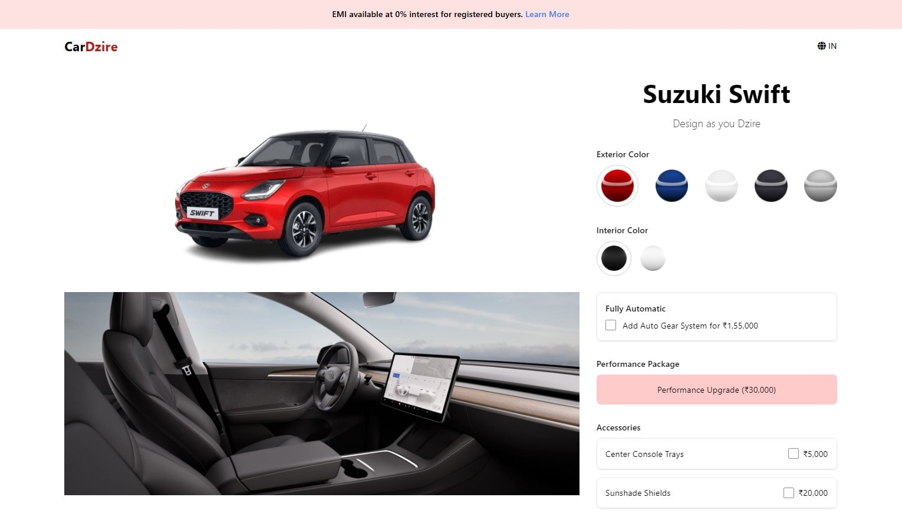

# CarDzire - A Tesla Car Configuration Clone

CarDzire is a Tesla-inspired car configuration clone built using HTML, CSS, and JavaScript. Users can customize a Suzuki Swift with various exterior and interior options, as well as performance upgrades and accessories, and see real-time price updates along with EMI calculations.

## Live Preview

Please visit [CarDzire - Live](https://cardzire-dk.netlify.app) to see the site's live preview.



## Features

- **Exterior Customization:** Choose from multiple exterior colors.
- **Interior Customization:** Toggle between light and dark interior options.
- **Performance Customizations:** Select from various performance and accessories upgrades.
- **Price Breakdown:** See a detailed estimate including EMI calculations.

## Installation

1. Clone the repository:

   ```bash
   git clone https://github.com/yodkwtf/car-dzire-javascript.git
   ```

2. Navigate to the project directory:

   ```bash
   cd car-dzire-javascript
   ```

3. Open the `index.html` file in your browser.

## Contributing

Contributions are welcome! Please fork the repository and submit a pull request for any updates.

## Contact

- **Email:** [48durgesh.kumar@gmail.com](mailto:48durgesh.kumar@gmail.com)
- **LinkedIn:** [Durgesh Chaudhary](https://www.linkedin.com/in/durgesh-chaudhary/)
- **GitHub:** [@yodkwtf](https://github.com/yodkwtf)
